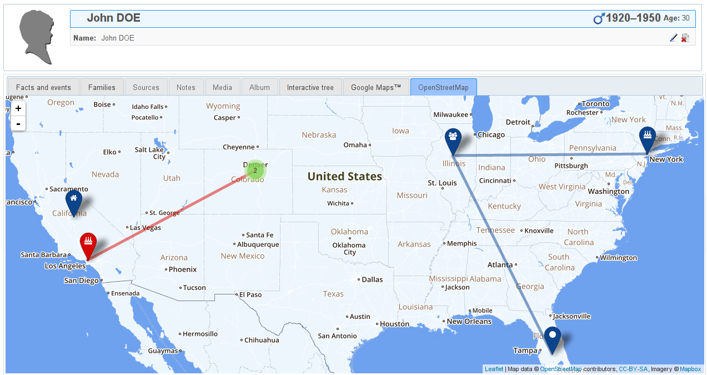
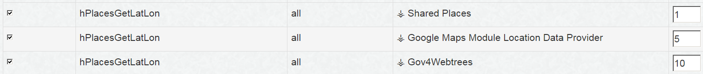

# Webtrees Custom Module: ⚶ OpenStreetMap

This is a [webtrees](https://www.webtrees.net/) custom module. 
The project’s website is [cissee.de](https://cissee.de). 
The original module is on [github](https://github.com/dkniffin/webtrees-openstreetmap).

This is a webtrees 1.x module - It cannot be used with webtrees 2.x. For its webtrees 2.x counterpart, see [here](https://github.com/vesta-webtrees-2-custom-modules/vesta_places_and_pedigree_map).

## Contents

* [Features](#features)
* [Download](#download)
* [Installation](#installation)
* [License](#license)

### Features<a name="features"/>

* This custom module displays location data via OpenStreetMap tiles and the Leaflet library (v1.3.1, plus Leaflet.markercluster v1.3.0).

* Location data is obtained directly from gedcom data, and may also be provided by other custom modules via the 'hPlacesGetLatLon' hook. 

* The direct dependency to the Google Maps module has been removed. If you have collected location data via the Google Maps module, simply activate the 'Google Maps Module Location Data Provider' custom module to make this data available.

* If you have multiple custom modules providing location data, you can change their priority via the Hooks module configuration:

### Download<a name="download"/>

* Current version: 1.7.13.1
* Based on and tested with webtrees 1.7.13, may also work with older 1.7.x versions.
* Requires the Hooks module ('hooks_repackaged', or the original Hooks module via webtrees-geneajaubart).
* Requires the 'vesta_common_lib' module.
* Download the zipped module, including all related modules, [here](https://cissee.de/vesta.latest.zip).
* Support, suggestions, feature requests: <ric@richard-cissee.de>
* Issues also via <https://github.com/ric2016/openstreetmap_hooked/issues>. Note that new features will only be implemented in the 2.x versions though.

### Installation

* Unzip the files and copy them to the modules_v3 folder of your webtrees installation. All related modules are included in the zip file. It's safe to overwrite the respective directories if they already exist (they are bundled with other custom modules as well), as long as other custom models using these dependencies are also upgraded to their respective latest versions.
* Enable the main module via Control Panel -> Modules -> Module Administration -> OpenStreetMap.
* Enable the Hooks module via Control Panel -> Modules -> Module Administration -> Hooks. Make sure all hooks are selected (in the preferences of the Hooks module).

### License<a name="license"/>

* **openstreetmap_hooked: a webtrees custom module**
* Copyright (C) 2017 to 2019 Richard Cissée

* Derived from **webtrees** - Copyright (C) 2010 to 2016  webtrees development team.
* Derived from **webtrees-geneajaubart** - Copyright (C) 2009 to 2016  Jonathan Jaubart.
* Derived from **openstreetmap** - Copyright (C) 2017 Derek Kniffin. See file 'LICENSE' for additional permission notice.
* Derived from **Leaflet** - Copyright (c) 2010-2017, Vladimir Agafonkin; Copyright (c) 2010-2011, CloudMade. See file 'LICENSE' for additional permission notice.
* Derived from **Leaflet.markercluster** - Copyright (C) 2012 David Leaver. See file 'LICENSE' for additional permission notice.
* French translations provided by Pierre Dousselin.

This program is free software: you can redistribute it and/or modify
it under the terms of the GNU General Public License as published by
the Free Software Foundation, either version 3 of the License, or
(at your option) any later version.

This program is distributed in the hope that it will be useful,
but WITHOUT ANY WARRANTY; without even the implied warranty of
MERCHANTABILITY or FITNESS FOR A PARTICULAR PURPOSE. See the
GNU General Public License for more details.

You should have received a copy of the GNU General Public License
along with this program. If not, see <http://www.gnu.org/licenses/>.
